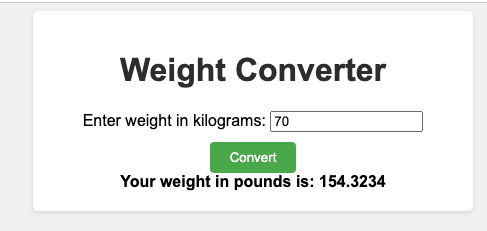
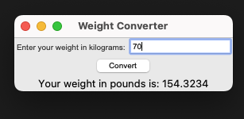

# calling_functions_in_Python
Exercise to practice writing and calling functions in Python

# kg_to_pound_converter

Here's a step-by-step guide to help you write the program:
1. Define a function named `kg_to_pounds` that takes a weight in kilograms (`kg`) as input.
2. Inside the `kg_to_pounds` function, multiply the weight (`kg`) by the conversion factor `2.20462`. This will give you the equivalent weight in pounds.
3. Return the calculated weight in pounds.
4. In the main part of your program, prompt the user to enter a weight in kilograms.
5. Use the `input` function to read the user's input and convert it to a float using the `float` function.
6. Call the `kg_to_pounds` function with the entered weight as the argument, and assign the result to a variable named `converted_weight`.
7. Print the converted weight using the `print` function, with an appropriate message.


# Extra: If you are a lady-dev like me😉


To give the program a CSS styling, you can create an HTML file that incorporates the program code and apply the desired CSS styles to it. Here's a step-by-step guide:
1. Create a new HTML file and open it in a text editor.
2. Start by writing the HTML boilerplate code. This includes the `<!DOCTYPE html>` declaration, `<html>`, `<head>`, and `<body>` tags.
3. In the `<head>` section of your HTML, add a `<style>` tag to include your CSS styles.
4. Inside the `<style>` tag, define the CSS styles you want to apply to your program. This can include styles for headings, inputs, buttons, etc.
5. In the `<body>` section of your HTML, add the necessary elements to display your program. This can include text containers, input fields, and buttons.
6. Paste your Python program code inside a `<script>` tag right before the closing `</body>` tag.
7. Use JavaScript to interact with the DOM elements on your page. For example, you can use JavaScript to read the values entered in the input fields and display the result in a specific HTML element.
8. Save the HTML file and open it in a web browser to see the styled program.
Keep in mind that with this approach, the program runs on the client-side and requires JavaScript to interact with the HTML elements. If you want the program to run directly in the Python environment and display styled output, you may consider using a GUI library like Tkinter.
Let me know if you have any further questions or need assistance with specific parts of the process!

# ExtraExtra: If you are a die-hard lady-dev👠😉



Here's a step-by-step guide to creating a program that runs directly in the Python environment using the Tkinter library for GUI and displaying styled output:
1. Import the `tkinter` module: `import tkinter as tk`
2. Create an instance of the Tk class to create the main window: `window = tk.Tk()`
3. Use the `title()` method to set the title of the window: `window.title("Weight Converter")`
4. Create Tkinter variables to hold the user input and converted weight: `input_var = tk.StringVar()`, `result_var = tk.StringVar()`
5. Create a label to display instructions: `instructions_label = tk.Label(window, text="Enter weight in kilograms:")`
6. Create an Entry widget to receive the user input: `input_entry = tk.Entry(window, textvariable=input_var)`
7. Create a button to perform the conversion: `convert_button = tk.Button(window, text="Convert", command=convert_weight)`
8. Define the `convert_weight()` function that performs the conversion when the button is clicked. Update the `result_var` with the converted weight: `result_var.set("The weight in pounds is: " + str(float(input_var.get()) * 2.20462))`
9. Create a label to display the result: `result_label = tk.Label(window, textvariable=result_var)`
10. Use the `grid()` method to arrange the widgets in a grid layout: 
```
instructions_label.grid(row=0, column=0)
input_entry.grid(row=0, column=1)
convert_button.grid(row=1, columnspan=2)
result_label.grid(row=2, columnspan=2)
```

11. Use the `configure()` method to style the labels and button, such as setting their font, text color, and background color.
12. Call the `mainloop()` method to start the Tkinter event loop and display the window.

